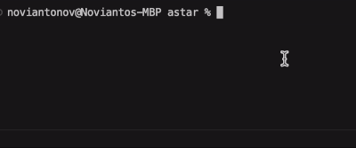

# puzzle 3x3 with a* algorithm implementation

## how to run
`go run main.go`

## control
| key | description             |
| --- | ----------------------- |
| l   | move base point to left |
| r   | move base point to right|
| u   | move base point to up   |
| d   | move base point to down |

note: input key and press enter

## run auto solve using a*
type `auto solve` and enter

## preview
